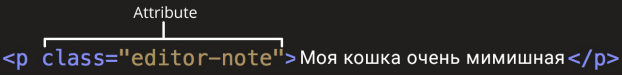

# Основы HTML

## Что такое HTML

HTML (Hypertext Markup Language) - это код, который используется для структурирования и отображения вебстраницы и её
контента. Например, контент (какой-то текст) может быть представлен в виде множества параграфов, маркированных списков
или с использованием изображений и таблиц данных. Пришло время познакомиться с основами HTML и его функциями.

Разметка в HTML осуществляется с помощью тегов – это метки, размечающие и каталогизирующие информацию для облегчения
процесса поиска. Иными словами, теги – это ключевые слова, по которым браузер ориентируется, как воспринимать и
оформлять материал на сайте.

Например, предложение на сайте

> Выбирайте красивый адрес

на самом деле будет обернуто тегами, сообщающим браузеру, что это текст абзаца, выглядит так:

```html
<p> Выбирайте красивый адрес </p>
```

## Анатомия HTML элемента


### Главными частями нашего элемента являются:

1. **Открывающий тег (Opening tag)**: Состоит из имени элемента (в данном случае, "p"), заключённого в
   открывающие и закрывающие угловые скобки. Открывающий тег указывает, где элемент начинается
   или начинает действовать, в данном случае — где начинается абзац/
2. **Закрывающий тег (Closing tag)**: Это то же самое, что и открывающий тег, за исключением того, что он
   включает в себя косую черту перед именем элемента. Закрывающий элемент указывает, где элемент
   заканчивается, в данном случае — где заканчивается абзац. Отсутствие закрывающего тега является
   одной из наиболее распространённых ошибок начинающих и может приводить к странным
   результатам.
3. **Контент (Content)**: Это контент элемента, который в данном случае является просто текстом.
4. **Элемент(Element)**: Открывающий тег, закрывающий тег и контент вместе составляют элемент.

### Элементы также могут иметь атрибуты, которые выглядят так:

```html
<p align=”center”> Выбирайте красивый адрес </p>
```

У тегов могут быть какие-либо свойства. Например, мы хотим в приведенном примере выровнять текст по центру, для этого мы
будем использовать атрибут align со значением centre, которое укажем в кавычках.

Атрибуты содержат дополнительную информацию об элементе, которую вы не хотите показывать в фактическом контенте.



В данном случае, class это имя атрибута, а editor-note это значение атрибута. Класс позволяет дать элементу
идентификационное имя, которое может позже использоваться, чтобы обращаться к элементу с информацией о стиле и прочих
вещах.

### Атрибут всегда должен иметь:

1. пробел между ним и именем элемента (или предыдущим атрибутом, если элемент уже имеет один или несколько атрибутов);
2. имя атрибута, за которым следует знак равенства;
3. значение атрибута, заключённое с двух сторон в кавычки.

