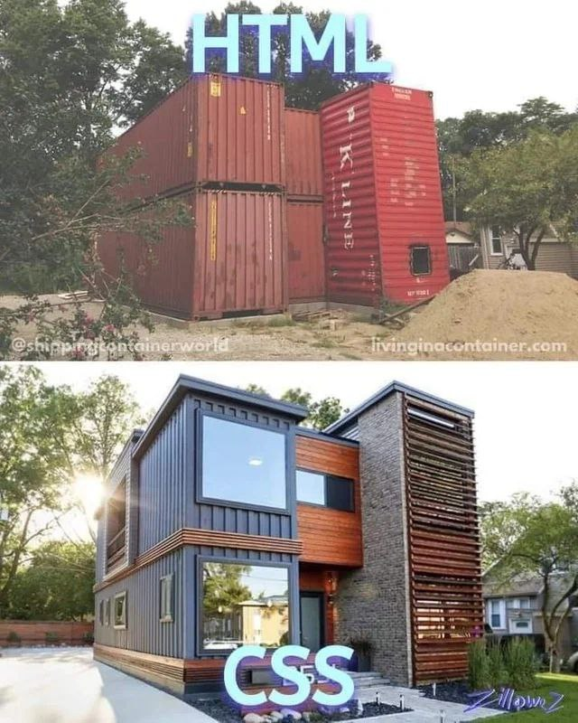
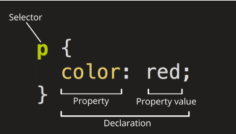

# Основы CSS



CSS (Cascading Style Sheets) — это код, который вы используете для стилизации вашей веб-страницы. Основы
CSS помогут сделать текст черным или красным, поставить контент в определённом месте на экране,
украсить веб-страницу с помощью фоновых изображений и цветов.

Как и HTML, CSS на самом деле не является языком программирования. Это не язык разметки - это язык
таблицы стилей. Это означает, что он позволяет применять стили выборочно к элементам в документах HTML.
Например, чтобы выбрать все элементы абзаца на HTML странице и изменить текст внутри них с чёрного
на красный, необходимо написать этот CSS код:

```css
p {
 color: red;
}
```

Давайте вставим эти три строки CSS в новый файл в ваш текстовый редактор, а затем сохраним файл
как style.css в вашей папке styles (в ту же папку, где находится наша страница «первая HTML-страница.html»).

Но нам всё равно нужно применить CSS к нашему HTML документу. В противном случае, CSS стиль не повлияет на то, как ваш
браузер отобразит HTML документ.

1. Откройте ваш файл index.html и вставьте следующую строку куда-нибудь в шапку, между head тегами:

```html

<link href="styles/style.css" rel="stylesheet" type="text/css">
```

2. Сохраните index.html и загрузите его в вашем браузере

Если текст вашего абзаца теперь красный, примите наши поздравления! Вы написали свой первый успешный CSS!

## Анатомия набора правил CSS

Давайте взглянем на вышеупомянутый CSS немного более подробно:



Вся структура называется набором правил (но зачастую для краткости "правило"). Отметим также имена отдельных частей:

+ **Селектор (Selector)**

  Имя HTML-элемента в начале набора правил. Он выбирает элемент(ы) для применения стиля (в данном
  случае, элементы p). Для стилизации другого элемента, просто измените селектор.
+ **Объявление (Declaration)**

  Единственное правило, например color: red; указывает, какие из свойств элемента вы хотите стилизовать.
+ **Свойства (Properties)**
  Способы, которыми вы можете стилизовать определённый HTML-элемент (в данном случае, color является
  свойством для элементов <p>). В CSS вы выбираете, какие свойства вы хотите затронуть в вашем правиле.


