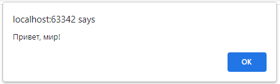

# Основы JavaScript

## Рассмотрим основные типы данных, поучимся с ними работать, а также разберемся с циклами и функциями в JS

Если пока то, что мы изучили, показалось вам не сложным, значит, дальше тоже проблем не возникнет.

Хотя как говорила Алиса в стране чудес: «Чем дальше, тем чудесатее и чудесатее». И теперь мы, наконец,
добрались до программирования. До этого эта была только верстка. Если же этот факт вас напугал или
расстроил, то не грустите, помните из истории Web, JS вначале не воспринимался серьезно разработчиками
– считался слишком легким, для новичков.

## Подключение JS

Чтобы добавлять js-программки (скрипты) на html-страницу, необходим тег ```<script>```.

```html
<!DOCTYPE html>
<html>
<head>
    <meta charset="utf-8">
</head>
<body>
<p>Это обычный HTML документ</p>
<script language="JavaScript">
 alert ("Привет, мир!");
</script>
<p>Выходим обратно в HTML</p>
</body>
</html>
```

Браузер читает HTML-документ сверху вниз, и начинает отображать страницу, показывая часть документа до
тега ```<script>```. Встретив тег ```<script>```, переключается в JavaScript-режим и выполняет сценарий. В нашем коде он
встречает оператор alert и понимает, что нужно вывести на экран все то, что заключено в кавычки.



Как только браузер закончил выполнение, он возвращается обратно в HTML-режим и отображает оставшуюся
часть документа.
Если JavaScript-кода много, его выносят в отдельный файл, который, как правило, имеет расширение *.js.

Чтобы JavaScript-кoд включить в HTML-документ из внешнего файла, нужно использовать атрибут src (source)
тега ```<script>```. Его значением должен быть URL-aдpec файла, в котором содержится JS-код:

```html

<script src="/scripts/script.js"></script>
```

В этом примере указан путь к файлу с именем script.js, который содержит скрипт. Принцип указания пути
аналогичен тому случаю, когда мы вставляли картинки в html-документ с помощью тега ``````. При этом файл
script.js должен содержать только JavaScript-кoд, который в другом бы случае располагался бы между
тегами ```<script>``` и ```</script>```.

## Примитивные типы данных

Значение в JavaScript всегда относится к данным определённого типа. Например, это может быть строка или
число. В JavaScript имеются следующие примитивные типы данных: number, boolean, string, undefined, null.

Переменная в JavaScript может содержать любые данные. Там может быть строка вначале, а далее, например
– число:

```javascript
// Это не ошибка
let message = "string";
message = 1234;
```

Языки программирования, в которых так можно, называются «динамически типизированными». Это значит,
что типы данных есть, но переменные не привязаны ни к одному из них.

## Числа

```javascript
let n = 321;
n = 54.321;
```

В этой конструкции let – зарезервированное слово, которое аналогично математическому: «Пусть n = 123».
Вместо let еще можно встретить var.

Числовой тип данных (number) представляет как целочисленные значения, так и числа с плавающей точкой
(для представления дробей). С числами можно осуществлять арифметические операции, например,
умножение *, деление /, сложение +, вычитание - и так далее.

Кроме обычных чисел, в js существуют спецефические числовые значения: Infinity и NaN. Они относятся к
типу «число». Конечно, это не числа в привычном значении этого слова.

+ Infinity представляет собой математическую бесконечность ∞.

Это особое значение, которое больше любого числа.

Мы можем получить его в результате деления на ноль:
```javascript
alert( 5 / 0 ); // Infinity
```

Или задать его явно:

```javascript
alert( Infinity ); // Infinity
```


+ NaN (Not a Number) означает вычислительную ошибку.

+ Это результат неправильной или неопределённой математической операции, например:

```javascript
alert( "не число" / 4 ); // NaN, такое деление является ошибкой
```

Значение NaN «прилипчиво». Любая операция с NaN возвращает NaN:

```javascript
alert( "не число" / 4 + 5 ); // NaN
```

Если в математическом выражении присутствует переменная с типом NaN, то результатом вычислений также
будет NaN. Это не сложно понять, например, делишь «не число» на число, результатом будет «не число».

Помните, мы говорили о том, что JS не считался серьезным языком? Именно потому, что математические
операции в JavaScript «безопасны». Можно делить на нуль, вычислять невычисляемые выражения и от этого
ничего не перестанет работать.

## Строки

Строка (string) в JavaScript заключается в кавычки.

```javascript
let str = "Это строка";
```
В JavaScript можно встретить три типа кавычек:

+ Двойные кавычки: "Это строковый тип данных".
+ Одинарные кавычки: ' Это строковый тип данных '.
+ Обратные кавычки: \`Это строковый тип данных `.

Между двойными и одинарными кавычками для JS разницы не существует. Обратные же кавычки имеют
расширенную функциональность. Они позволяют нам встраивать выражения в строку, заключая их в ${…}.
Например:

```javascript
let name = "Саша";
let name = 'Саша';
// Вставим переменную
alert( `Привет, ${name}!` ); // Привет, Саша!
// Вставим выражение
alert( `результат: ${2 + 2}` ); // результат: 4
```

Выражение внутри ${…} вычисляется, и его результат становится частью строки. Мы можем положить туда всё,
что угодно: переменную name, или выражение 2 + 2, или что-то более сложное.
Все данные, которые мы вводим с клавиатуры по умолчанию для JS принадлежат строковому типу.


