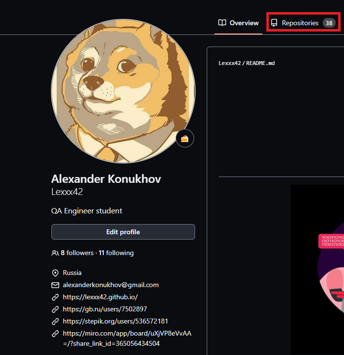
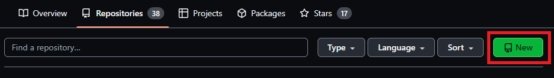
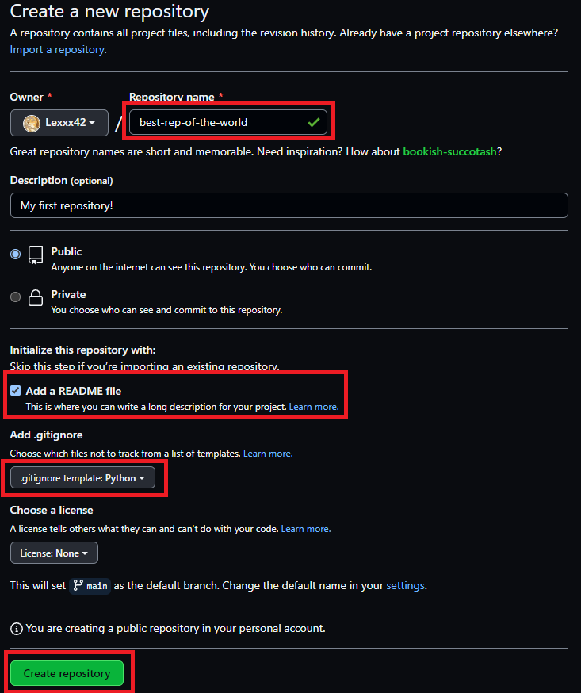
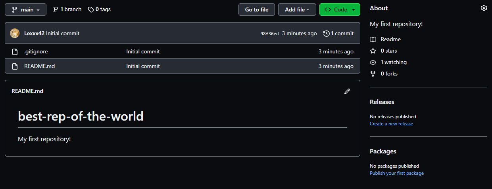
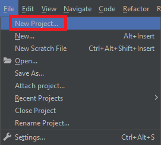
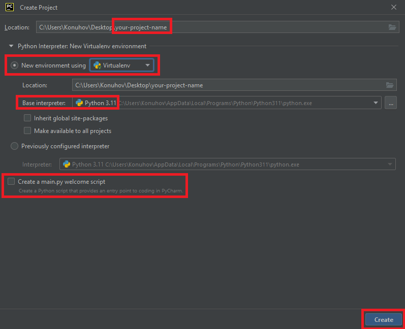

# Создание репозитория в GitHub

## Подготовительные действия

+ Установить [git](https://git-scm.com/downloads)
+ Установить [PyCharm](https://www.jetbrains.com/pycharm/download)
+ Установить интерпретатор [Python](https://www.python.org/downloads/) версии не ниже 3.10.6
+ Зарегистироваться в [GitHub](https://github.com/)

## Создание репозитория

### Создание удалённого репозитория

1. Открыть страницу своего профиля GitHub.

2. Нажать на таб "Repositories".

3. Нажать на кнопку "New"

3. Заполнить обязательные поля. Не забываем добавить README.md и .gitignore (Python)

4. Нажать кнопку "Create repository"

### Клонирование удалённого репозитория в локальный

1. Открыть PyCharm

2. Нажать "File", выбрать "New Project..."

3. Заполнить форму создания проекта. Обязательно указать виртуальное окружение и интерпретатор Python.

4. Нажать "Create"

