# Основные команды git

## Разберем самые важные команды git, которые используются постоянно:

+ коммиты;
+ создание веток;
+ переключения между ветками;
+ пул реквесты;
+ слияния веток;
+ разрешение конфликтов.

### Создание веток

Работать будем в PyCharm. Использовать консольные команды не будем, разработчики постарались сделать интуитивно понятный
интерфейс для работы с системой контроля версий, которым грех не воспользоваться. Но знать консольные команды
необходимо, это пригодится в работе с ОС без графического интерфейса.

+ Итак, посмотрим на первоначальное состояние нашего репозитория:

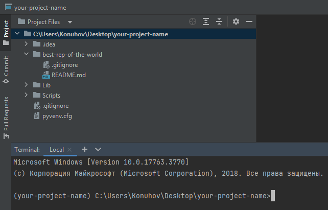

+ Отделим новую ветку от ветки main. Для этого переключимся на таб Git в нижней панели PyCharm -> ПКМ на main.

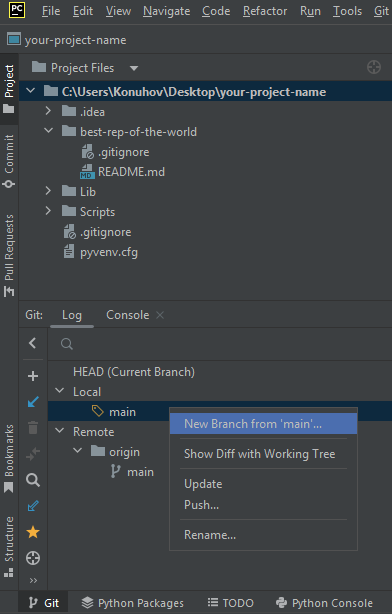

+ В выпадающем меню выбираем пункт "New Branch from 'main'..."

+ Вводим имя нашей новой ветки и нажимаем кнопку "Create"

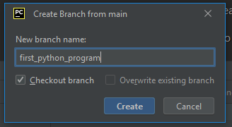

+ Все изменения принято вносить в главную ветку через слияния второстепенных. К тому же этот механизм позволяет работать
  с репозиторием одновременно нескольким разработчикам. Убеждаемся, что мы действительно перешли на новую ветку: в
  правом нижнем углу PyCharm отображается текущая активная ветка, в панели Git, можно ввести консольную команду:

```shell
git branch
```

### Создадим нашу первую программу на языке Python

+ ПКМ по имени репозитория -> New -> Python File

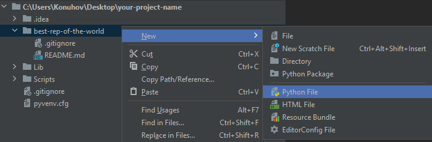

+ Я назвал свой новый файл `python_program`, ты можешь назвать его как угодно. Но есть нюансы, с которыми будет лучше,
  если ты сам столкнешься и решишь их. Далее IDE спросит добавить ли файл в отслеживаемые. Соглашаемся.

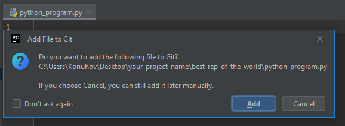

+ Обрати внимание, что файл сейчас выделяется зелёным цветом.

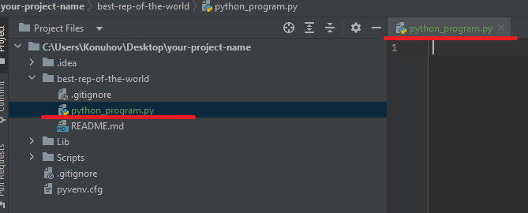

Это значит, что это новый контент, которые ещё не зафиксирован.

+ Давай зафиксируем новое изменение нашего репозитория в новой ветке. Говорят "закоммитимся".
+ Перейдем во вкладку "Commit" в левом сайдбаре IDE -> Отметим изменение, которое мы хотим зафиксировать в чекбоксе ->
  нашишем адекватное сообщение о коммите (принято писать осмысленные сообщения на английском языке) -> Нажать кнопку "
  Commit"

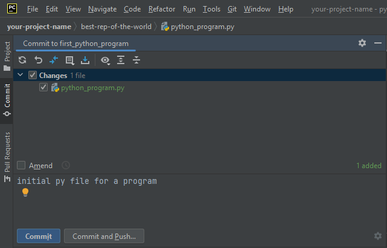

+ Обрати внимание, что файл перестал выделяться зелёным цветом. Это занчит, что изменения сохранены.

+ Напишем классическую программу о приветствии мира внутри файла `python_program.py`

```python
def hello_world():
    print('Hello World!')


hello_world()

```

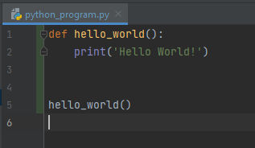

+ Сразу заострим внимание на нескольких вещах:
    + Пропущенные строчки. Позже ты познакомишься с особенностями языка Python и правилами написания кода. Пока
      используй автоформатирование, которое предлагает IDE PyCharm. Можешь посмотреть в настройках комбинацию клавишь
      для твоей машины
      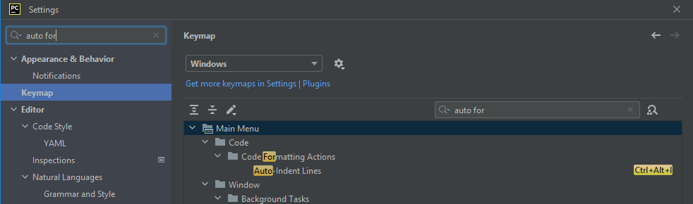

    + Если у тебя установлен интерпретатор Python, то подсвечивается синтаксис языка.
    + Скрипт можно запустить используя сочетание клавиш или нажав на зеленый треугольник на любой из панелей открытого
      файла.
      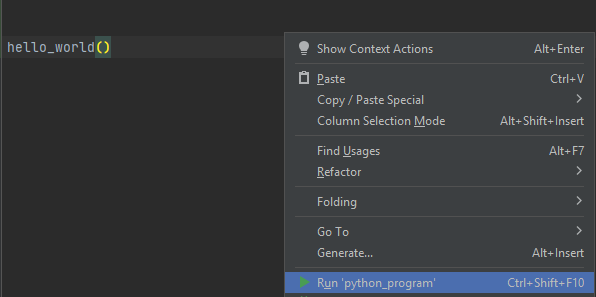
      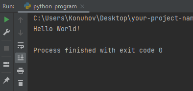

+ Закоммитим изменения.

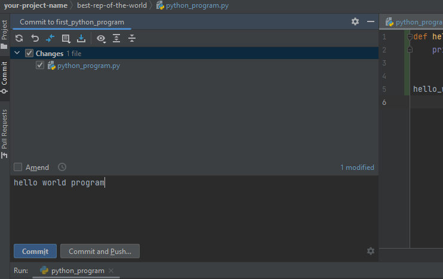


