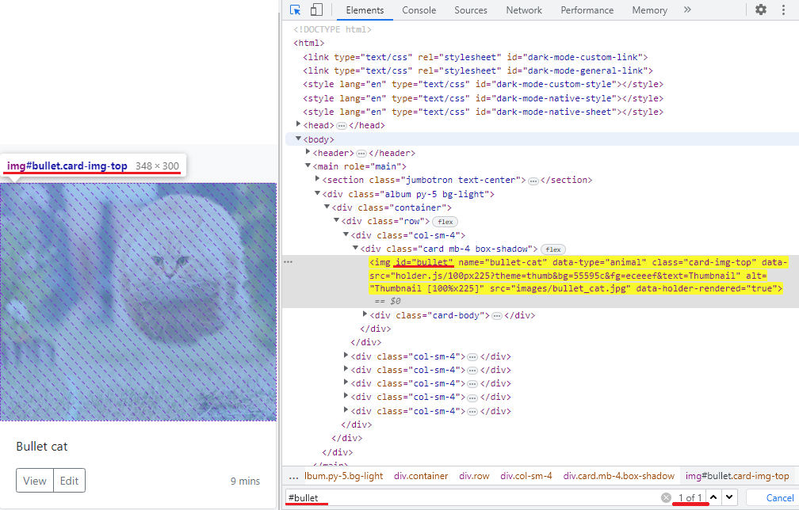

# Поиск элементов

## Поиск элементов с помощью CSS-селекторов

Ниже приведены части элементов HTML-страницы, по которым можно найти элемент:

+ id
+ tag
+ значение атрибута
+ name
+ class

Давайте откроем страницу [Cats album](http://suninjuly.github.io/cats.html) и попробуем найти элемент, который содержит
картинку с Котом-пулей (Bullet cat).

Чтобы это сделать вам потребуется использовать DevTools вашего браузера. Я рекомендую вам
использовать [Google Chrome](https://www.google.com/chrome/).

Для включения DevTools можно нажать F12 на клавиатуре.

Ниже приведён упрощенный кусок html-кода страницы:

```html

<div class="col-sm-4">
    <div class="card mb-4 box-shadow">
        
    </div>
</div>
```

Для начала мы попробуем искать элементы вручную с помощью консоли браузера, а в следующем уроке научимся писать код,
который выполняет ту же задачу поиска.

### Поиск по id

Какое везение! У элемента с нашей картинкой есть атрибут id="bullet", а значит, мы однозначно можем найти её с помощью
селектора **#bullet** (знак # означает, что мы ищем по **id** со значением **bullet**).

Можно проверить правильность подобранного селектора непосредственно в браузере в консоли разработчика. Откройте консоль
разработчика и перейдите в ней на вкладку Elements. Затем нажмите ctrl+F и в открывшейся внизу поисковой строке введите
селектор. Если селектор написан правильно, то вы увидите подсвеченный элемент на веб-странице, а также элемент будет
подсвечен жёлтым цветом в html-коде. Еще в поисковой строке вы увидите количество найденных элементов. Желательно писать
точные селекторы, которые позволяют найти ровно один элемент. В написании таких селекторов мы потренируемся в одной из
следующих задач.

Еще один способ открыть консоль разработчика в браузере: нажать правой кнопкой мыши на любой элемент страницы и выбрать
пункт меню "Посмотреть код" (англ. "Inspect") в контекстном меню. При этом на вкладке Elements сразу будет подсвечен
кусок HTML-кода, описывающий данный элемент.




