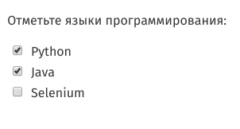
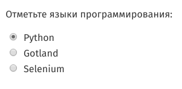

# Основные методы Selenium

## Как работать с элементами типа checkbox и radiobutton?

Checkbox (чекбокс или флажок) и radiobutton (радиобаттон или переключатель) — часто используемые в формах элементы.
Основная разница между ними состоит в том, что флажки позволяют выбирать/отключать любой из представленных вариантов, а
переключатели позволяют выбрать только один из вариантов. Далее мы будем называть эти элементы на англоязычный манер:
checkbox и radiobutton.

Так выглядят checkboxes:



А это radiobuttons:



Оба этих элемента создаются при помощи тега `input` со значением атрибута `type` равным `checkbox` или `radio`
соответственно. В html-коде страницы вы увидите:

```html
<input type="checkbox">
<input type="radio">
```

Если checkbox или radiobutton выбран, то у элемента появится новый атрибут `checked` без значения. Часто
атрибут `checked` уже установлен для одного из элементов по умолчанию.

```html
<input type="checkbox" checked>
<input type="radio" checked>
```

Radiobuttons объединяются в группу, где все элементы имеют одинаковые значения атрибута `name`, но разные значения
атрибута `value`:

```html
<input type="radio" name="language" value="python" checked>
<input type="radio" name="language" value="selenium">
```

Checkboxes могут иметь как одинаковые, так и разные значения атрибута name. Поэтому и те, и другие лучше искать с
помощью значения `id` или значения атрибута `value`. Если вы видите на странице чекбокс с уникальным значением name, то
можете искать по name.

Чтобы снять/поставить галочку в элементе типа checkbox или выбрать опцию из группы radiobuttons, надо указать WebDriver
метод поиска элемента и выполнить для найденного элемента метод `click()`:

```python
option1 = browser.find_element(By.CSS_SELECTOR, "[value='python']")
option1.click()
```

Также вы можете увидеть тег `label` рядом с `input`. Этот тег используется, чтобы сделать кликабельным текст, который
отображается рядом с флажком. Этот текст заключен внутри тега `label`. Элемент `label` связывается с элементом `input` с
помощью атрибута `for`, в котором указывается значение атрибута `id` для элемента `input`:

```html

<div>
    <input type="radio" id="python" name="language" checked>
    <label for="python">Python</label>
</div>
<div>
    <input type="radio" id="java" name="language">
    <label for="java">Java</label>
</div>
```

В этом случае можно также отметить нужный пункт с помощью WebDriver, выполнив метод `click()` на элементе `label`.

```python
option1 = browser.find_element(By.CSS_SELECTOR, "[for='java']")
option1.click()
```
