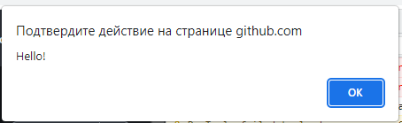
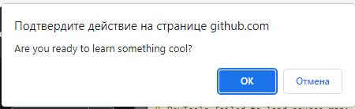
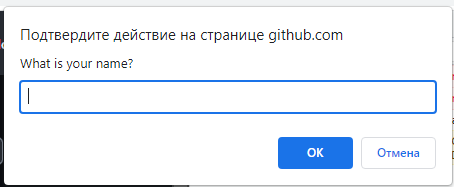

# Работа с окнами

## Alerts

Мы уже сталкивались с алертами, когда получали числовые ответы в задачах. Кроме того, мы узнали, что можно
создавать алерты с помощью JavaScript:

```javascript
alert('Hello!');
```



Давайте теперь рассмотрим сценарий, в котором тестовый сценарий требует не только получения содержимого предупреждения,
но и нажатия кнопки OK, чтобы закрыть его. Оповещение — это модальное окно, что означает, что пользователь не может
взаимодействовать с интерфейсом, пока оповещение не будет закрыто. Чтобы отклонить предупреждение, тестер должен сначала
переключиться в окно предупреждения, а затем использовать команду `accept()`.

```javascript
alert = browser.switch_to.alert
alert.accept()
```

Чтобы получить текст из alert, используйте свойство text объекта alert:

```javascript
alert = browser.switch_to.alert
alert_text = alert.text
```

Другой тип модального окна, который предоставляет пользователю возможность либо принять, либо отклонить сообщение,
называется диалоговым окном `confirm`. Для переключения в окно `confirm` можно использовать ту же команду, что и
для `alert`:

```javascript
confirm = browser.switch_to.alert
confirm.accept()
```



Для confirm-окон можно использовать следующий метод для отказа:

```javascript
confirm.dismiss()
```

То же самое, что и при нажатии пользователем кнопки "Отмена".
Третий вариант модального окна — `prompt` — имеет дополнительное поле для ввода текста. Чтобы ввести текст, используйте
метод `send_keys()`:

```javascript
prompt = browser.switch_to.alert
prompt.send_keys("My answer")
prompt.accept()
```



## Задание: принимаем alert

В этой задаче вам нужно написать программу, которая будет выполнять следующий сценарий:

1. Открыть страницу http://suninjuly.github.io/alert_accept.html
2. Нажать на кнопку
3. Принять confirm
4. На новой странице решить капчу для роботов, чтобы получить число с ответом

Если все сделано правильно и достаточно быстро (в этой задаче тоже есть ограничение по времени), вы увидите окно с
числом.

## Переход на новую вкладку браузера

При работе с веб-приложениями часто встречаются ссылки, которые открываются в новой вкладке браузера. Однако WebDriver
может одновременно взаимодействовать только с одной вкладкой браузера. Когда ссылка открывается в новой вкладке,
WebDriver продолжит работу на старой вкладке. Чтобы переключиться на только что открытую вкладку, нам нужно явно
указать, с какой вкладкой мы хотим работать. Этого можно добиться с помощью команды `switch_to.window`:

```javascript
browser.switch_to.window(window_name)
```

Чтобы определить имя вновь открытой вкладки, можно использовать метод `window_handles`, который возвращает массив имен
всех вкладок. Как только мы подтвердим, что две вкладки открыты, мы можем переключиться на вторую вкладку, используя
соответствующую индексацию:

```javascript
new_window = browser.window_handles[1]
```

Также мы можем запомнить имя текущей вкладки, чтобы иметь возможность потом к ней вернуться:

```javascript
first_window = browser.window_handles[0]
```

После переключения на новую вкладку поиск и взаимодействие с элементами будут происходить уже на новой странице.
