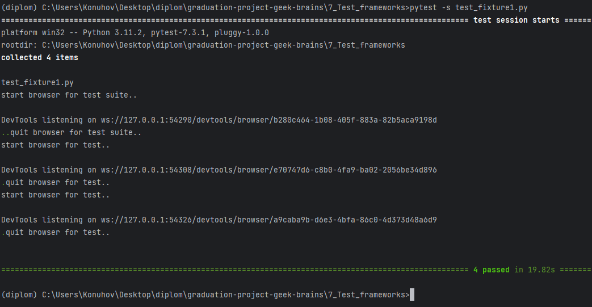

# Использование фикстур в PyTest

В контексте PyTest фикстуры — это вспомогательные функции для тестов, которые существуют вне самого тестового сценария.

Фикстуры служат различным целям, включая подготовку тестовой среды, очистку тестовой среды и данных после завершения
теста, подключение к базам данных, создание тестовых файлов и подготовку данных в текущей среде с использованием методов
API. Для получения дополнительной информации о фикстурах в самом широком смысле см. статью
в [Википедии](https://en.wikipedia.org/wiki/Test_fixture#Software) на эту тему.

Традиционный подход к использованию фикстур предполагает создание методов настройки и демонтажа в тестовом файле. Вы
можете найти более подробную информацию о том, как использовать эти методы
в [документации PyTest](https://docs.pytest.org/en/latest/how-to/xunit_setup.html).

Фикстуры можно создавать для различных областей, таких как модули, классы и отдельные функции в PyTest. Мы можем создать
фикстуру для инициализации браузера, которую можно использовать в наших тестах. Чтобы избежать нескольких открытых окон
браузера, мы закроем браузер с помощью команды `browser.quit()` после завершения выполнения тестов. Переместив код
инициализации и закрытия браузера в фикстуры, мы можем повторно использовать код в нескольких тестах, не повторяя его
каждый раз.

Чтобы организовать наши тесты, мы сгруппируем их в тестовые наборы, используя классы в качестве контейнеров.

Давайте рассмотрим два примера, иллюстрирующих использование фикстур. Первый пример включает создание экземпляра
браузера и его закрытие только один раз для всех тестов в наборе тестов. Напротив, во втором примере создается браузер
для каждого теста в наборе тестов. Вы можете сохранить приведенный ниже код в файл с именем `test_fixture1.py` и
запустить его с помощью PyTest. Чтобы увидеть вывод команды `print()`, не забудьте использовать параметр `-s`.

```shell
pytest -s test_fixture1.py
```

В консоли видим:



Мы видим, что в первом тест-сьюте браузер запустился один раз, а во втором — два раза.

Запуск каждого теста в отдельном экземпляре браузера считается хорошей практикой, поскольку оставшиеся данные и кеш
предыдущих тестов могут потенциально повлиять на результаты последующих тестов. Такой подход обеспечивает большую
стабильность и надежность при тестировании. Более того, выполнение каждого теста в отдельном экземпляре браузера может
предотвратить влияние проблем, которые могут возникнуть из-за зависания браузера во время одного теста, на другие тесты.

Запуск браузера для каждого теста имеет некоторые недостатки. Каждый запуск и выход из браузера требует времени, что
может увеличить продолжительность тестов. Если вам нужно оптимизировать время выполнения тестов, рекомендуется
использовать другие инструменты, о которых речь пойдет позже.

Как правило, эти фикстуры включаются в тесты, написанные на модульном тесте, и требуют обслуживания. Однако в настоящее
время используются более гибкие фикстуры @pytest.fixture.
