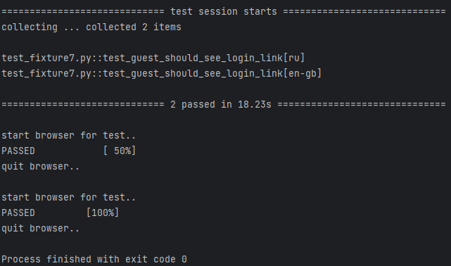

# PyTest — параметризация, конфигурирование, плагины

## Conftest.py — конфигурация тестов

В предыдущем разделе мы создали фикстуру браузера `browser`, которая создает экземпляр браузера для тестирования в
текущем файле.
Однако, когда у нас есть несколько тестовых файлов, может быть неудобно переопределять эту фикстуру в каждом файле.
Чтобы избежать этого повторения и сохранить часто используемые фикстуры и глобальные настройки, мы можем использовать
файл `conftest.py`, который должен находиться в каталоге верхнего уровня нашего тестового проекта.
Хотя можно создавать
дополнительные файлы `conftest.py` в других каталогах, любые настройки, определенные в этих файлах, будут применяться
только к тестам в подкаталогах.

Мы можем создать файл `conftest.py` в каталоге верхнего уровня нашего тестового проекта и переместить туда фикстуру
браузера для хранения часто используемых фикстур и глобальных настроек. Благодаря этому файл с тестами становится более
лаконичным.

> conftest.py:

```python
import pytest
from selenium import webdriver
from selenium.webdriver.common.by import By


@pytest.fixture(scope="function")
def browser():
    print("\nstart browser for test..")
    browser = webdriver.Chrome()
    yield browser
    print("\nquit browser..")
    browser.quit()
```

С добавлением файла `conftest.py` в корневой каталог тестового проекта доступ к фикстуре браузера теперь возможен для
всех тестовых файлов.
Фикстура передается тестовому методу в качестве аргумента, что позволяет легко повторно использовать
вспомогательные функции в разных частях проекта, независимо от того, сколько тестовых файлов создано.

> test_conftest.py:

```python
from selenium.webdriver.common.by import By

link = "http://selenium1py.pythonanywhere.com/"


def test_guest_should_see_login_link(browser):
    browser.get(link)
    browser.find_element(By.CSS_SELECTOR, "#login_link")
```

### ОЧЕНЬ ВАЖНО!

Крайне важно понять важный аспект поведения файлов конфигурации. PyTest автоматически обнаруживает и загружает файлы
`conftest.py` в каталог с тестами. Если у вас все тестовые сценарии в одной папке, будьте осторожны и не запускайте
тесты из папки с тестами, так как это может помешать автоматическому обнаружению файлов conftest.py:

```
tests/
├── conftest.py
├── subfolder
│   └── conftest.py
│   └── test_abs.py

следует избегать!
```

Если тесты запускаются из каталога, содержащего два файла conftest.py, будут применены оба файла, что может привести к
непредвиденным ошибкам и конфликтам.

Этот метод можно использовать для переопределения различных фикстур, но для знакомства рекомендуется придерживаться
одного файла для каждого проекта/задачи и сохранять их в горизонтальном порядке, например:

```
selenium_course_solutions/
├── section3
│   └── conftest.py
│   └── test_languages.py
├── section4 
│   └── conftest.py
│   └── test_main_page.py

правильно!
```

Подробнее можете ознакомиться в документации:
[Override a fixture on a folder (conftest) level](https://docs.pytest.org/en/7.1.x/how-to/fixtures.html?highlight=fixture%20folder#override-a-fixture-on-a-folder-conftest-level)

## Параметризация тестов

Используя декоратор `@pytest.mark.parametrize()` в PyTest, вы можете запустить один и тот же тест с различными входными
параметрами. Например, предположим, что наш веб-сайт доступен на разных языках. Мы можем написать тест, который
проверяет, отображается ли ссылка на форму входа для русской и английской версий главной страницы сайта. Мы можем
передать в наш тест ссылки на русскую и английскую версии главной страницы сайта.

Чтобы использовать декоратор `@pytest.mark.parametrize()`, вам необходимо указать параметр,
который необходимо изменить, и список значений параметров.
Тест также должен передавать параметр в качестве аргумента. Важно отметить, что при
использовании декоратора имя параметра заключается в кавычки, а в списке тестовых аргументов кавычки не нужны.

> test_fixture7.py:

```python
import pytest
from selenium import webdriver
from selenium.webdriver.common.by import By


@pytest.fixture(scope="function")
def browser():
    print("\nstart browser for test..")
    browser = webdriver.Chrome()
    yield browser
    print("\nquit browser..")
    browser.quit()


@pytest.mark.parametrize('language', ["ru", "en-gb"])
def test_guest_should_see_login_link(browser, language):
    link = f"http://selenium1py.pythonanywhere.com/{language}/"
    browser.get(link)
    browser.find_element(By.CSS_SELECTOR, "#login_link")
```

Запустите тест:

```shell
pytest -s -v test_fixture7.py
```

При запуске теста вы увидите два запущенных теста, при этом имя каждого теста отображает параметр, с которым он был
запущен, заключенный в квадратные скобки. Такой подход помогает увеличить количество проверок по схожим сценариям без
дублирования кода.



Чтобы указать параметры для всех тестов в классе, перед объявлением класса следует поставить знак параметризации. Это
применит указанные параметры ко всем тестам в классе:

```python
@pytest.mark.parametrize('language', ["ru", "en-gb"])
class TestLogin:
    def test_guest_should_see_login_link(self, browser, language):
        link = f"http://selenium1py.pythonanywhere.com/{language}/"
        browser.get(link)
        browser.find_element(By.CSS_SELECTOR, "#login_link")
        # этот тест запустится 2 раза

    def test_guest_should_see_navbar_element(self, browser, language):
        pass
        # этот тест тоже запустится дважды
```

Дополнительно ознакомьтесь с документацией
[How to parametrize fixtures and test functions](https://docs.pytest.org/en/latest/how-to/parametrize.html)

## Установка Firefox и Selenium-драйвера geckodriver

До сих пор мы выполняли наши тесты только в браузере Chrome. Однако что, если мы хотим протестировать наше
веб-приложение и в других браузерах? В таком сценарии мы можем запускать одни и те же тесты в разных браузерах, указав
имя браузера при запуске тестов. Например, мы можем выбрать Firefox в качестве второго браузера, поскольку он широко
используется и может работать на любой платформе. Чтобы запустить тесты в конкретном браузере, нам нужно указать
параметр `browser_name` при запуске с помощью следующей команды:

```shell
pytest -s -v --browser_name=firefox test_cmd.py
```

Установите последнюю версию браузера Firefox для вашей платформы:
[Firefox Browser](https://www.mozilla.org/en-US/firefox/new/)

Selenium-драйвер для Firefox носит название geckodriver.

Последнюю версию драйвера можно скачать [geckodriver](https://github.com/mozilla/geckodriver/releases)

Ознакомьтесь с [инструкцией по установке драйвера](https://selenium-python.com/install-geckodriver) и не забудьте
добавить его в PATH для пользователей с ОС Windows.


